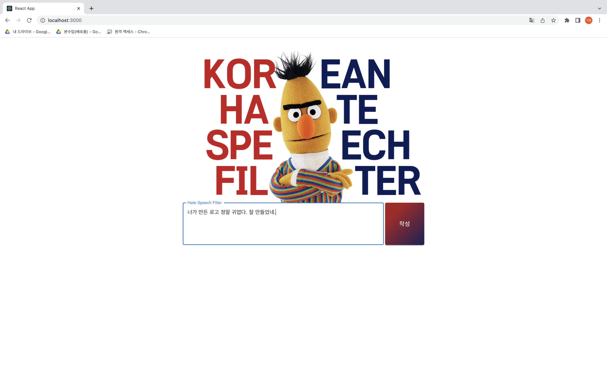
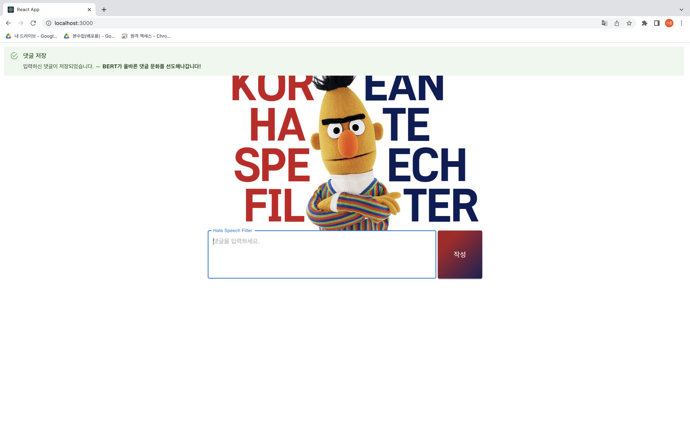

# Korean Hate Speech Filter
This project was conducted in 2021-1 semester as part of Konkuk univ. Open Source SW Project 1 project.\
It functions as a discriminator whether sentence that client inputs is a hate-speech, using KoBERT.


* [Hate Speech Filter](#hate-speech-filter)
  * [How to install](#how-to-install)
    * [Clone project and install modules](#clone-project-and-install-modules)
    * [Get model checkpoint file](#get-model-checkpoint-file-for-load)
  * [Getting Started](#getting-started)
    * [Run flask server](#run-flask-server)
    * [Run front-end](#run-front-end)
  * [Demo](#demo)
  * [Model Architecture](#model-architecture)
  * [Test Accuracy](#test-accuracy)
  * [Reference](#reference)
    * [KoBERT](#kobert)
    * [Data](#data)

---

## How to install

### Clone project and install modules
```
git clone https://github.com/kkjsw17/Korean-Hate-Speech-Filter.git
cd Korean-Hate-Speech-Filter
npm i
pip install -r requirements.txt
```

### Get model checkpoint file (for load)
```
python src/server/get_model.py
```

## Getting started

### Run flask server
```
python src/server/app.py
```

### Run front-end
```
npm start
```

## Demo
> Please click to see image bigger
<table>
  <tr>
   <td align=center>Pass</td>
   <td align=center>Detection</td>
  </tr>
  <tr>
    <td></td>
    <td></td>
  </tr>
  <tr>
    <td></td>
    <td></td>
  </tr>
</table>


## Model Architecture

### 1. BERT


### 2. BERT + CNN


### 3. BERT + Ensembled CNN


### 4. BERT + Ensembled CNN + BiLSTM


## Test Accuracy


## Reference

### KoBERT
https://github.com/SKTBrain/KoBERT

### Data
1. [Korean HateSpeech Dataset, ](https://github.com/kocohub/korean-hate-speech/blob/master/labeled/train.tsv)
2. [korean-malicious-comments-dataset](https://github.com/ZIZUN/korean-malicious-comments-dataset)
